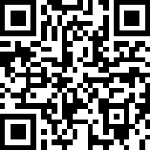

<!--
 * @Author: 石破天惊
 * @email: shanshang130@gmail.com
 * @Date: 2021-08-04 00:34:29
 * @LastEditTime: 2021-08-05 19:41:06
 * @LastEditors: 石破天惊
 * @Description: 
-->

# react-native-pattern-lock

A smooth pattern lock component for react native.(iOS, android & web)
## Preview

  

## Install

RN 0.60+ with pod
```
yarn add react-native-gesture-handler react-native-reanimated react-native-svg @shanshang/react-native-pattern-lock
npx pod-install
```

## Documentation

```
import {PatternLock} from "@shanshang/react-native-pattern-lock";
```

Props | Type | Default | Description
---- | ------ | --------- | --------
message | string | "" | The header message on the top of the PatternLock.
rowCount | number | 3 | Number of circle rows.
columnCount | number | 3 | Number of circle columns.
patternMargin | number | 25 | Margin between circles.
inactiveColor | Color | "#8E91A8" | inactiveColor.
activeColor | Color | "#5FA8FC" | activeColor.
errorColor | Color | "#D93609" | errorColor.
onCheck | (res:string)=>boolean | undefined | Callback on end drawing, return `false` to shake message.

## Online Experience


web: click [here](http://pl.bolan9999.com) or Scan the QR code below on mobile brower.


iOS : Download `expo go` app from App Store. Scan the QR code below in Camera app, and then click Open with `expo go`.

android: Download `expo go` app from App Store. Scan the QR code below in expo go app.

 


## License

react-native-largelist is released under the MIT license. View LICENSE for details.